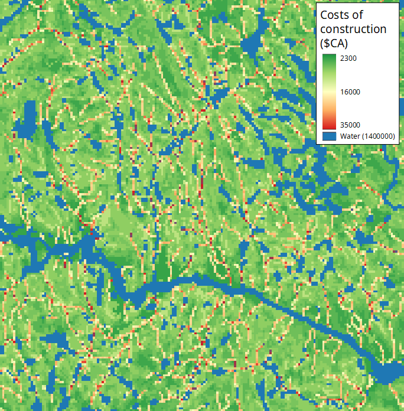

# Presentation

## Why are forest roads so important ?

Forest roads are a particular type of roads [@gucinskiForestRoadsSynthesis2001]. They are often defined in an implicit manner in articles that talk about them. Here, **we will define forest roads road as roads that have been constructed to access forest ressources**, even if they can be maintained for several purposes [@huntManagingForestRoad2009; @laschiMethodologicalApproachExploiting2016; @thompsonForestRoadsOperational2021; @zhangApproachImprovingFirefighting2020]. These roads **traverse forest ecosystems, and they often present a surface layer of gravel or of local soil**, even if they can sometimes be paved.

Forest roads are not always taken into account when talking about the effects and impacts of forest management. However, they can have important effects on forest ecosystems  [@bostonPotentialEffectsForest2016]. Indeed, they have been shown to :

- Reduce the surrounding macroinvertebrate soil fauna [@haskellEffectsForestRoads2000]
- Reduce the abundance of some beetles [@koivulaEffectsForestRoads2005]
- Alter the quality of habitat for several species of birds [@ortegaEffectsForestRoads1999]
- Fragment the forest landscape more than clearcuts do [@reedContributionRoadsForest1996]
- Repeal forest species such as the elk [@witmerEffectForestRoads1985]
- Increase the predation of caribou by wolves [@jamesDistributionCaribouWolves2000; @whittingtonCaribouEncountersWolves2011]
- Shape the spatial boundaries of forest fires [@narayanarajInfluencesForestRoads2011; @yocomPreviousFiresRoads2019]
- Create social issues between different types of "users" of the forest : aboriginal communities, recreationists, hunters, and so on [@adam2012forestry; @bourgeoisRoutesForestieresAu2005; @huntManagingForestRoad2009; @kneeshawAccessibiliteForestiereAccrue2006].

They also represent an important operational cost for forestry industries, varying between 5% to almost 18% of the total operational costs [@groupeddmEnqueteCoutsOperation2020; @toscani2020forest].

As you can see, forest roads can have many different impacts, and are important to take into account when studying forest ecosystems at the landscape scale. **That is why their simulation with changing forest management strategies and legislation can be crucial to better conserve forest ecosystems**.

* * *

`r emo::ji("question")` **Examples of research questions in ecology related to the simulation of forest roads : **

- How do different forest management strategies fragment the landscape, when forest roads are taken into account ?
- What will be the impact of forest roads on endangered species, as they increase the movement of potential predators ?
- How will forest roads constructed in a newly harvested area affect hunting pressure ?

* * *

## The FRS module

The Forest Road Simulation (FRS) module is an extension for LANDIS-II, whose goal is to **dynamically simulate a forest road network according to the harvested areas in the landscape**.

Here is an animation showing the evolution of road networks simulated with the FRS module in Quebec :

### Goals of the FRS module

The FRS module was designed with 4 considerations in mind :

1. It should be easy to understand and use
2. It should be able to reproduce the main characteristics of a real forest road network at the landscape scale
3. It should not rely on low-level features of forest roads network that have limited influence at the landscape scale
4. It should have a performance comparable to those of other LANDIS-II extensions

We will now see how those considerations are tackled by the FRS module. However, if you want to know all of the details concerning the functioning and the performance of the module, you should read the article presenting the module [@hardyLANDISIIExtensionDynamically2021], as well as [the user guide](https://github.com/Klemet/LANDIS-II-Forest-Roads-Simulation-module/blob/master/LANDIS-II%20Forest%20Roads%20Simulation%20v1.1%20User%20Guide.pdf).

### Structure of the FRS module

The FRS module interacts with the simulation made by LANDIS-II in a particular way. Indeed, in its current version, its functioning is influenced by the presence of areas harvested by a harvest extension. However, it does not influence the position of the harvested area, and it currently does not influence the forest landscape either.

As such, the FRS module edits its own particular spatial dataset in parallel to the vegetation map simulated by LANDIS-II. We call this dataset, which is a raster map with the same exact format as the other spatial data in LANDIS-II, the "road landscape".

Hence, the FRS module creates roads on raster cells, using pathfinding algorithms. The roads that it creates are not vectorial, as this would require a lot more computations and parameters for a questionable gains in terms its ability to replicate reality.

### Solving the MTAP

To properly understand how the FRS module functions, one has to understand the Multiple Target Access Problem (MTAP). The MTAP is simply the problem of trying to reach multiple targets (nodes) in a graph via roads that link them (vertices) in an optimal way (least-cost, least-distance, best speed, etc.). As the number of targets increase, the number of possible configurations for the resulting road network becomes very great. How, then, can we find the optimal configuration according to a set of priorities ? Which roads (or vertices) should be built, and which ones should not ?

With the advances in computer technology, the MTAP was formulated and described in the context of forest operations [@heinimannForestRoadNetwork2017]. However, despite the capacity of computer to execute an enormous number of calculations, the MTAP can still be considered unsolvable in reasonable time frames as soon as a certain number of targets is reached, because of the near-infinite number of possible configurations for the network. This is especially true if the "cost" associated with the vertices (as a cost of construction) must be calculated at the same time.

Meanwhile, there exist another type of problem that computers are able to solve in a very, very short time : the Single Target Access Problem (STAP). In a STAP, as only one target exist, the only calculation that should be made is to determine the best path, road or vertex to the target.

The STAP can be easily solved with the use of a pathfinding algorithm, such as the famous Dijkstra algorithm [@dijkstraNoteTwoProblems1959]. Therefore, one possible way to solve a MTAP is to use a [heuristic](https://en.wikipedia.org/wiki/Heuristic) to transform in MTAP into an ordered set of STAPs that will be solved one after the other by a pathfinding algorithm. This approach is used in professional software, such as Remsoft's Road Optimizer [@remsoftRemsoftRoadOptimizer2019], and has been used in previous research on the problem of forest road network design [@andersonDeterminingOptimalRoad2006; @heinimannForestRoadNetwork2017].

Different heuristics can be used, in order to determine the set of STAP to solve [@shirasawaComparativeStudyHeuristic2014]. Such heuristics can be "make roads toward target nearest to a road first", or "make roads to and between targets in a random order".

Note that in the MTAP, the targets are already determined. This makes the MTAP different from what is called an "integrated forest harvest-scheduling", which corresponds to finding the optimal location of areas to harvest, alongside an optimal configuration for the resulting forest road network [@heinimannForestRoadNetwork2017]. The FRS module doesn't go that far, and lets the harvest extensions of LANDIS-II decide where the harvested areas will be located.

Therefore, the FRS module solves an MTAP using a heuristics, and lets the user choose amongst three : "Closest first" (build roads to area closest to existing roads first); "Farthest first" (the opposite of "Closest first"); and "Random" (build roads to harvested areas in a random order). To determine the path of the roads in space, the FRS module uses the Dijkstra algorithm, along with a cost map.

## The functioning of the FRS module

Now that we have seen the theory behind the design of the FRS module, we will quickly talk about its functioning. Again, readers interested in more details than what is given here can take a look at the article presenting the module [@hardyLANDISIIExtensionDynamically2021], as well as [the user guide](https://github.com/Klemet/LANDIS-II-Forest-Roads-Simulation-module/blob/master/LANDIS-II%20Forest%20Roads%20Simulation%20v1.1%20User%20Guide.pdf).

### Initialisation phase

LANDIS-II simulations always start with an initialisation phase, during which the different rasters needed by the model are read, the parameters read, and the different extensions prepared for the rest of the simulation.

The FRS module uses the initialisation phase to create what is called the "cost map". **The cost map is a raster map in which each pixel represent the estimated cost of construction to construct a road in order to cross the pixel, whatever the direction of the crossing**.

Here is an example of a cost map generated by the FRS module :

On this cost map, you can see water bodies very clearly, as they require constructing bridges that can be very costly to construct, or even prohibited depending on the legislation in place. The path of streams are visible, as they require one or multiple culverts to be posed to traverse them. Then, you can see that the costs of constructions change according to the slope.

To create such a map, the FRS module uses maps of landscape features and several cost parameters associated to them. Only one landscape feature - and its associated parameters - is necessary; the others are optional, in order to adapt to what data the user has at hand. However, the more features are taken into account, the more the roads created by the module will be realistic.

Currently, the FRS module can take into account :

- The slope
- The presence of topographic obstacles requiring a detour (cliffs, breaks, etc.)
- The presence of bodies of water (lakes, rivers)
- The presence of streams
- The types of soil

Once that the cost map has been created, the FRS module ends up the initialisation phase by "completing" the initial road network map that has been given by the user. Indeed, this map should contain existing roads and forest roads, alongside what we called "**exit points**". This category is considered by the module as places where the wood harvested in the landscape can “exit” the landscape (to be sold or used). Every initial road landscape must have at least one site of this category, as **the FRS module has for objective to connect harvested areas to exit points, or to roads that are connected to exit points themselves**. Currently, exit points are static throughout the simulation: they are not created or deleted through time.

If some roads in the initial road landscape are not connected to any exit points, the FRS module will "complete" the network by adding new road segments so that they are connected. This is done in order to correct possible missing roads in road databases.

### During the simulation

Once that the initialisation phase of LANDIS-II is other, the simulation starts. Each extension of LANDIS-II are called, according to their time step.

The FRS module should be parameterized to always be called after the harvest extension has been activated. Once that it activates, the FRS module functions this way :

1. If road aging has been activated, the FRS module will age the roads of the landscape. If the roads become older than their maximum age of use, they are considered destroyed. Every road starts at an age 0 when constructed, and this age is only reset when a road is updated (see below). If a road is destroyed and then rebuilt in the same timestep, it is considered as repaired.
2. The cells recently harvested by the harvest extension are ordered according to the heuristic chosen by the user. Hence, each cell represents a target to reach in the MTAP.
3. Roads are constructed to the recently harvested cell, by considering them in their order. However, a road is only built if the given harvested cell is not already at a skidding distance from an existing road. In that case, the wood is considered as skidded to the nearby road pixel. Roads that are built must lead to the recently harvested cell of interest, but can start from any existing road pixel, as long as this road pixel is connected one way or another to an exit point.
4. If the loop algorithm is activated, the FRS module will attempt to create a loop in the road network. It does this by creating a second road to the recently harvested cell. This can be important for certain fragmentation indices that are sensitive to the existence of "patches" that are completely surrounded by roads or by non-forest habitat.
5. If the harvest extension is parameterized to use repeated harvested (e.g. shelterwood harvest or periodic uneven-aged cuts), then the FRS module will adapt to the need to return to the harvested cell in the futur. In particular, the module will chose the cheapest option between creating a low-grade road that might need to be re-built or repaired for the next passage; or a higher-grade road, more costly, that will still be in place next time.
6. Finally, if the computation of wood fluxes is activated, the FRS module will simulate the transport of wood from the harvested area to the exit points of the landscape. This flux will influence the way that forest roads are upgraded to larger, higher-grade roads to adapt to the flux of trucks.

Once that all of this is done, the FRS module creates raster maps corresponding to snapshots of the road landscape at the end of the time step, and then stops until the next time step when it will be activated.
