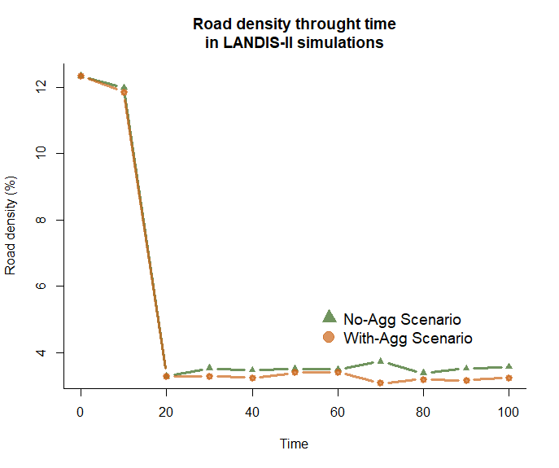
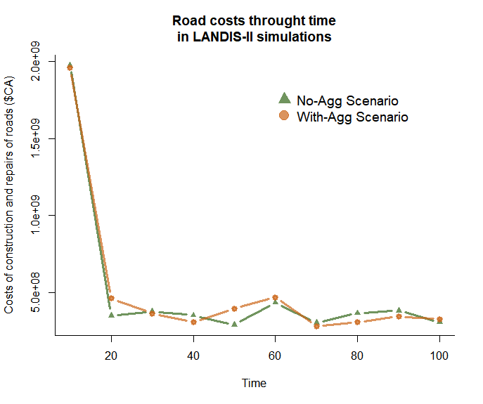
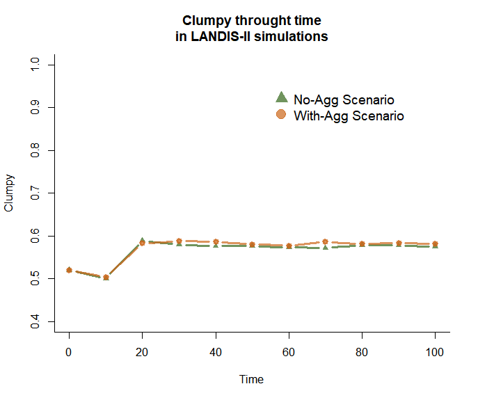
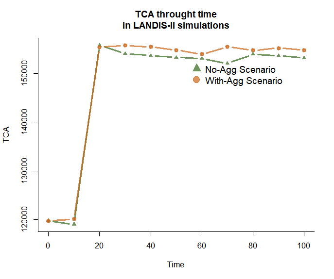

# Analyzing simulation results

In this section, we will launch two different LANDIS-II scenarios using the FRS extension, and analyze their results.

These scenarios will be identical, except for the fact that we will change the level of aggregation of the cut areas. Hence, looking at the results will allow us to see the effect of cut aggregation on several characteristics of the landscape.

## Ressources needed

In order to follow the exercise of this section, it is important that you have the following software installed on your computer :

- [LANDIS-II v. 7](http://www.landis-ii.org/install)
  - [Age-only Succession Extension v. 5.2](https://github.com/LANDIS-II-Foundation/Extension-Age-Only-Succession/raw/master/deploy/installer/LANDIS-II-V7%20Age%20Only%20Succession%205.2-setup.exe)
  - [Base Harvest Extension v. 5.1](https://github.com/LANDIS-II-Foundation/Extension-Base-Harvest/raw/master/deploy/installer/LANDIS-II-V7%20Base%20Harvest%205.1-setup.exe)
  - [FRS extension v. 1.3.1](https://github.com/Klemet/LANDIS-II-Forest-Roads-Simulation-extension/releases/download/1.2/LANDIS-II-V7.Forest.Road.Simulation.module.1.3.1-setup.exe)
- [QGIS 3.X](https://qgis.org)
- [R](https://www.r-project.org/) or [R studio](https://www.rstudio.com/)
  - Package `gtools`
  - Package `dplyr`
  - Package `rgdal`
  - Package `raster`
  - Package `landscapemetrics`

> `r emo::ji("light_bulb")` To install all of these R packages at once, use the command `install.packages(c("gtools", "dplyr", "rgdal", "raster", "landscapemetrics"))` in R.

In addition, **you need to download the data necessary for the exercices**: [`r emo::ji("floppy_disk")` Click here](https://minhaskamal.github.io/DownGit/#/home?url=https://github.com/Klemet/frs-extension-workshop/tree/main/landis-scenarios) !

> `r emo::ji("warning")` If you did not do the parameterisation exercice, copy the content of `roads_correction.txt` into the file `road.txt`, both located in the `shared-parameters/disturbances` folder. In addition, copy all of the rasters present in the folder `shared-rasters/correction` into `shared-rasters`.

## Understanding the two scenarios

Open the folder `scenario-no-aggregation`, and look at its files. You will see that it contain a LANDIS-II scenario file (`scenario-no-aggregation.txt`), a script to run the scenario (`run-scenario-no-aggregation.bat`), and a folder with the parameter file of the `Base harvest` extension. All of the other parameter files needed by this scenario are present in the folders `shared-rasters` and `shared-parameters`.

The folder `scenario-with-aggregation` has the exact same structure. The only change between the two scenarios is in the `SiteSelection PartialStandSpread` parameter. In the scenario without aggregation, the parameter is equal to the range between `1` and `200`. This means that the `Base harvest` extension will try to make cuts of `200` hectares but will stop if it can't fullfil the other conditions; and that it will accept cuts as small as `1` hectare. In the scenario with aggregation, the maximum limit of the cuts is increased to `1000` hectares, leading to much bigger (yet fewer) cut areas.

Before running the simulations, we will take a look at what happens when we change the parameters of the FRS extension.

## Looking at the cost map generated by the FRS extension

### With only the basal distance cost

Create a copy of the file `roads.txt` in the shared-parameters/disturbances folder, and then open it in a text editor. In addition, open the `scenario-no-aggregation` folder, and the software QGIS.

We will now edit the roads.txt file to better understand how the FRS extension "sees" your landscape. First, remove replace all of the additional cost values for the CoarseElevationCosts parameter with 0. You should now have the following:

```
CoarseElevationCosts
>> Lower elevation      Upper elevation        Additional
>>    threshold            threshold             value
		  0		      		   9            	   0
		  9		      	   	   16		   		   0
		  16		      	   41		   		   0
		  41	 	      	   10000		   	   0
```

Then, input the word "none" in place of the CoarseWaterRaster parameter. You should now have the following:

```
CoarseWaterRaster none
```

Then, delete the line corresponding to the CoarseWaterCost parameter.

No, run the file run-scenario-no-aggregation.bat located in the folder scenario-no-aggregation. A command prompt will open, running a LANDIS-II simulation. Read the text of the command prompt carefully. Once that the initialization phase of the fifth timestep of the simulation is over (when you can read "Current time: 60" in the command prompt), close the command prompt. Then, load the rasters roadNetwork-Cost Raster.tif and roadNetwork-60.tif present in the folder scenario-no-aggregation/output/disturbances/roads as layers in QGIS.

The roadNetwork-Cost Raster.tif raster is a raster representing the "cost map" as computed by the FRS extension, according to the cost parameters and maps that we entered. In each of its cell is the estimated average construction cost of a forest road traversing the cell, for a reference road type (see section 2). This "cost map" is used by the pathfinding algorithm of the FRS extension in charge of deciding the path of the roads.

Look at this raster. **Do you notice anything strange ?**

* * *
<details style="text-align: left !important; width: 60%  !important;">
  <summary>**Click for Answer**</summary>
  <br>
    Currently, all of the cells of the roadNetwork-Cost Raster.tif raster contain the same value, 894. This value is the basal distance cost that we found in section 2, exercice 6. This is because we inputed no cost parameter except the basal distance cost. Elevation, obstacles, water bodies, streams and soils are not taken into account. Therefore, from the point of view of the FRS extension, the landscape is a plain, homogeneous area where the cost of construction doesn't change.
</details>
* * *

Now, look at the roadNetwork-60.tif raster, which contains a snapshot of the roads landscape at the end of the first timestep of the simulation. **Do you notice anything strange ?**

* * *
<details style="text-align: left !important; width: 60%  !important;">
  <summary>**Click for Answer**</summary>
  <br>
    

    At the time step 60, the initial roads have disparead because if road aging, and have been replaced by roads entirely constructed by the FRS extension. We can see that many of the roads built by the extension are straight lines. This is because the cost of construction is the same in all of the cells of the cost map: in those conditions, the least-cost path between two points found by the pathfinding algorithm is always a straight line. Therefore, if you see straight lines in your results, you can be sure that it is because the FRS extension traversed an area with an homogeneous cost of construction. This is often a sign that something is wrong in the parameterization.
</details>
* * *

### With elevation costs included

Now, re-establish the correct values of the additional costs due to elevation in the file roads.txt, but keep the CoarseWaterRaster and CoarseWaterCost at "none" and deleted respectively. **Close the layers roadNetwork-Cost Raster.tif and roadNetwork-60.tif in QGIS, so that LANDIS-II can update them**.

Relaunch the file run-scenario-no-aggregation.bat locateed in the folder scenario-no-aggregation, and once again, wait after LANDIS-II has reached the 6th time step to stop the simulation. Open the rasters roadNetwork-Cost Raster.tif and roadNetwork-60.tif in QGIS again.

Look at roadNetwork-Cost Raster.tif in QGIS. Double click on the layer corresponding to it in the layer menu, and change its colors in the Symbology tab. What do you see ?

* * *
<details style="text-align: left !important; width: 60%  !important;">
  <summary>**Click for Answer**</summary>
  <br>
    

    Now, we can see that the cost map is not entirely homogeneous anymore. We can now distinguish 4 different types of costs, which correspond to the 4 levels of slope that we defined : 0-9%, 9-16%, 16-41%, and 41% to maximum values. Hence, the cost map became much more complex than before.
</details>
* * *

Now, look at the roadNetwork-60.tif raster in QGIS. Try to superimpose it to the cost map. What differences do you notice with what it was before ?

* * *
<details style="text-align: left !important; width: 60%  !important;">
  <summary>**Click for Answer**</summary>
  <br>
    

    We can see that the simulated road network contains a lot less "straight" roads, and that the path of the roads is often in less costly pixels. However, we can still notice some straight roads where areas of homogeneous cost exist.
</details>
* * *

### With elevation and water bodies included

Now, re-establish the correct values for the CoarseWaterRaster and CoarseWaterCost parameters in the file roads.txt. **Close the layers roadNetwork-Cost Raster.tif and roadNetwork-60.tif in QGIS, so that LANDIS-II can update them**.

Relaunch the file run-scenario-no-aggregation.bat locateed in the folder scenario-no-aggregation, and once again, wait after LANDIS-II has reached the 6th time step to stop the simulation. Open the rasters roadNetwork-Cost Raster.tif and roadNetwork-60.tif in QGIS again.

Look at roadNetwork-Cost Raster.tif in QGIS. Double click on the layer corresponding to it in the layer menu, and change its colors in the Symbology tab. What do you see ?

* * *
<details style="text-align: left !important; width: 60%  !important;">
  <summary>**Click for Answer**</summary>
  <br>
    
    *On this image, the pixels containing bodies of water have been colored in blue so as to better distinguish them from the rest.*

    We can now see that the cost map is complex and detailed. Homogeneous areas in terms of cost are few, and the pathfinding algorithm will have many features to avoid (steep slopes, lakes and rivers).
</details>
* * *

Now, look at the roadNetwork-60.tif raster in QGIS. Try to superimpose it to the cost map. What differences do you notice with what it was before ?

* * *
<details style="text-align: left !important; width: 60%  !important;">
  <summary>**Click for Answer**</summary>
  <br>
    

    We can see that the simulated road network now contains very few "straight" roads, and that road paths tend to follow elevation lines, and especially riverbeds.
</details>
* * *

In conclusion, you can see that **taking a look at the cost map generated by the FRS extension is important to validate your parameterization**, and avoid mistakes or incoherencies in your results. In particular, you should look out for :

- Large areas with homogeneous costs
- Islands which do not have an exit point of them (meaning that the FRS extension will create a bridge to reach the island, even if the wood is supposed to be floated away)
- Areas with costs that are too high or too low

## Launching the simulations

Now, make sure that the file roads.txt is complete. In case of doubts, copy and paste the contents of roads_corrections.txt inside of it.

Then, run the file run-scenario-no-aggregation.bat located in the folder scenario-no-aggregation and the file run-scenario-with-aggregation.bat located in the folder scenario-with-aggregation. Wait for the two simulations to finish.

## Looking at the outputs with QGIS

Go into the scenario-no-aggregation/output/harvest folder, and load the raster prescripts-10.tif as a layer in LANDIS-II. Now, do the same for the scenario-with-aggregation folder. **What do you notice ?**

* * *
<details style="text-align: left !important; width: 60%  !important;">
  <summary>**Click for Answer**</summary>
  <br>
    We can see that the cut areas in the scenario with aggregation are fewer, but much bigger that the cut areas in the scenario without aggregation.
</details>
* * *

Now, open the raster roadNetwork-60.tif from the scenario with and without aggregation in QGIS. **What differences do you notice between the two ?**

* * *
<details style="text-align: left !important; width: 60%  !important;">
  <summary>**Click for Answer**</summary>
  <br>
    We can see that in the scenario with aggregation, forest roads are less "scattered" than in the scenario without aggregation. They form dense networks of smaller roads inside the large cut areas, and link those together with higher-type roads traversing the landscape. In the scenario without aggregation, those patches of smaller roads corresponding to harvested areas are more scattered, leading to more higher-type roads linking them together.
</details>
* * *

## Analyzing the results with R

Now, open the file correction-result-analysis located in the exercice-analyse-results folder in R studio or R.

**Run the script line by line up to section 5 of the script**, reading the commentaries present in the script as you go. if you are not familiar with R code, you can take the time to understand in detail what the different commands correspond to.

Once that you have ran all of the commands of the section 5 of the script, look at the plot that the script have generated (showing the evolution of the road density in the landscape through time). **What do you notice ? How do you interpret it ?**

* * *
<details style="text-align: left !important; width: 60%  !important;">
  <summary>**Click for Answer**</summary>
  <br>
    

  We can see two things happening on the graph. First, we see a drastic decrease in the road density of the landscape, followed by a stabilisation showing a difference between the two scenarios.

  The drastic decrease at the beginning of the simulation is due to the initial road network disappearing because of road aging. This happens when most of the forest roads of the initial road network are not necessary for the FRS extension to reach harvested areas. When this happens, these initial roads will simply disappear if road aging has been simulated. The speed at which the forest road disappear depend on 1) the proportion of road types among the forest road pixels (primary, secondary, etc.); and 2) the maximal age associated to the road types. Here, our initial landscape is composed of many secondary roads, associated with the maximum age 15. Since all roads start with an age of 0, it will take two timestep for those roads to be destroyed if they are not maintained.
</details>
* * *

Now, run the commands of the section 6. Look at the plot that the script have generated (showing the evolution of the road costs through time). **What do you notice ? How do you interpret it ?**

* * *
<details style="text-align: left !important; width: 60%  !important;">
  <summary>**Click for Answer**</summary>
  <br>
    

In this graph, we see the same tendancy as the graph showing the evolution of the road density. It starts by a important decrease in costs of construction and repairs, followed by a relative stabilization of them through time.

First, let's look at the initial decrease. It comes from the fact that the first time step (*t* = 10) starts with a very important cost of construction. This can seem counter-intuitive, as the initial landscape contains many roads that the FRS extension can use instead of build. However, if we look at the outputs of LANDIS-II, we can see that this timestep contains many harvested area in the top-right of our landscape in both scenarios (resulting from patches of older forest that are favoured by the harvest extension). This leads to a huge flux of timber that passes through the initial road landscape, requiring to upgrade many road pixels to primary roads (which are very expensive) to adapt to this flux.

This price of road upgrade is increased even more by the fact that the FRS extension will go through the existing, initial road network so as to avoid building roads. However, this forces it to use a long path to reach the main road network in the south, as the initial road network does not present a road that is relatively short to reach it. In future version, the FRS extension will be able to find a better option.

**Therefore, remember that the FRS extension can currently present behaviours that might seem strange in initial timesteps. These can be due to the particular configuration of harvested areas, or the structure of the initial road network.**

The second part of the graph shows no clear differences between the scenario with and without aggregation of the cuts, in terms of costs of construction and repairs. This is due to the fact that while the scenario with aggregation might result in fewer roads, it also requires a higher proportion of large roads to accommodate the flux of timber trucks that will pass through this smaller amount of roads. This conclusion remains very sensitive to the flux threshold parameters for each road types, and should be taken with a grain of salt.
</details>
* * *

Now, run the commands of the section 7. Look at the plots that the script have generated (showing the evolution of the Clumpy and TCA fragmentation indices through time). **What do you notice ? How do you interpret it ?**

* * *
<details style="text-align: left !important; width: 60%  !important;">
  <summary>**Click for Answer**</summary>
  <br>
    
    

We can see that Clumpy and TCA are both slightly higher for the scenario with aggregation, implying less structural fragmentation of the landscape.

An interesting difference is that TCA (*Total Core Area*) is a index relative to the core area of the landscape (here, defined as pixels further than 100m from a forest edge), while Clumpy relates to the aggregation of the pixels of forests. TCA is also much more correlated to the quantity of habitat of the landscape than Clumpy is [@wangMeasuringHabitatFragmentation2014]. These differences explain why TCA reacts differently than Clumpy, and especially why the difference between scenarios is increased with TCA. This is because the scenario with aggregation reduces the fragmentation of the landscape (as shown by Clumpy), but also increases the quantity of forest in the lanscape (as less surface of forest is transformed into roads), benefiting TCA.
</details>
* * *
